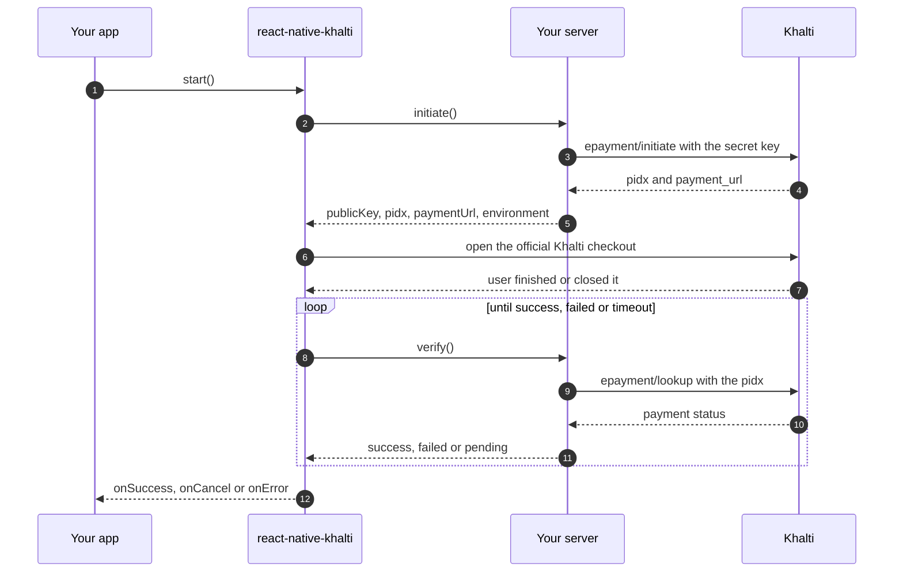
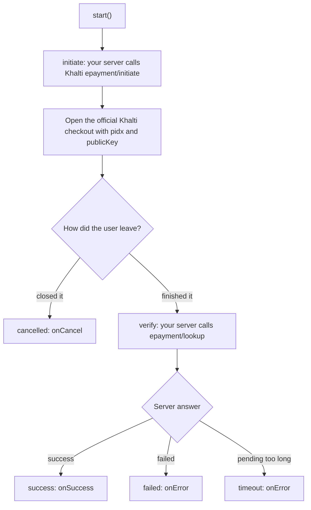
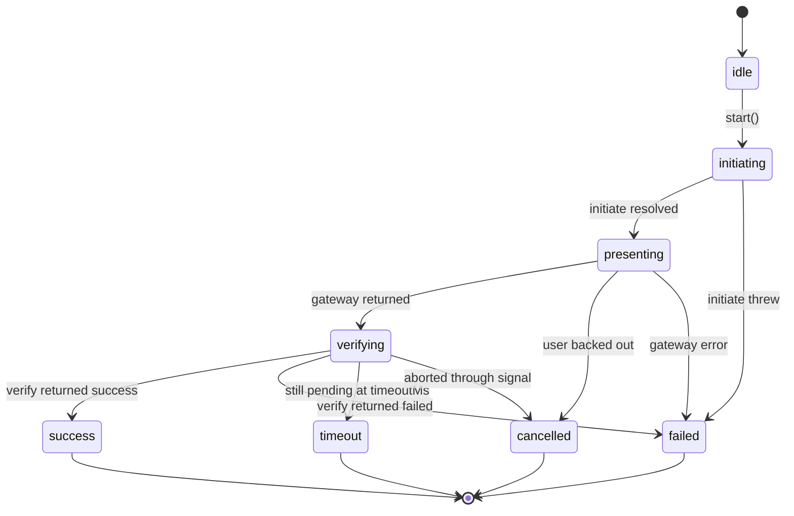

# @klixsoft/react-native-khalti

[](https://www.npmjs.com/package/@klixsoft/react-native-khalti)
[](https://www.npmjs.com/package/@klixsoft/react-native-khalti)
[](https://github.com/klixsoft/react-native-khalti/actions/workflows/ci.yml)
[](LICENSE)
[](#requirements)
[](#api)

Accept [Khalti](https://khalti.com) payments (KPG-2) in React Native with the **official Khalti Checkout SDKs**. Khalti publishes native SDKs but no React Native package, so this library is a thin, typed bridge over them, with a standard `initiate` / `verify` flow on top.

## Features

- Wraps the official SDKs: [`com.khalti:checkout-android`](https://github.com/khalti/checkout-sdk-android) and [`KhaltiCheckout`](https://github.com/khalti/checkout-sdk-ios) (nothing proprietary is bundled)
- One call for the whole payment: `processKhaltiPayment({ initiate, verify })`, or the `useKhaltiPayment` hook
- Low-level `pay()` when you want to control the steps yourself
- Typed results and stable error codes, including a clear "user cancelled"
- React Native **New Architecture** (TurboModule + codegen); Android module in Java so it never fights your Kotlin / AGP setup
- Works with sandbox and live environments

## Table of contents

- [Requirements](#requirements)
- [Installation](#installation)
- [How it works](#how-it-works)
- [Quick start](#quick-start)
- [Usage](#usage)
- [Server contract](#server-contract)
- [API](#api)
- [Common mistakes](#common-mistakes)
- [Errors](#errors)
- [Security](#security)
- [Documentation](#documentation)
- [Versioning and releases](#versioning-and-releases)
- [Contributing](#contributing)
- [License](#license)

## Requirements

- React Native **0.76+** with the New Architecture enabled
- Android `minSdk` 24, AndroidX
- iOS 13+, Swift 5, Xcode 15+

## Installation

```sh
pnpm add @klixsoft/react-native-khalti
# or: npm install @klixsoft/react-native-khalti   /   yarn add @klixsoft/react-native-khalti
```

### iOS

```sh
cd ios && pod install
```

### Android

No manual step: Gradle resolves `com.khalti:checkout-android` from Maven Central. Rebuild the native app after installing.

## How it works

Every Klixsoft payment package follows the same three-step lifecycle, so switching gateways does not change how your code is shaped:



> Diagrams are [Mermaid](https://mermaid.js.org). GitHub renders them; on npmjs.com they show as code, so read this README on GitHub for the pictures.

| Step | You provide | The package does |
| --- | --- | --- |
| **initiate** | A function that calls **your server**, which creates the payment with Khalti and returns `{ publicKey, pidx, paymentUrl?, environment? }`. | Calls it once, at the start. |
| **present** | Nothing. | Opens the **official Khalti Checkout SDK** (Android and iOS), not a WebView, and resolves when the user finishes or closes it. |
| **verify** | A function that calls **your server**, which asks Khalti's status API and returns `success`, `failed` or `pending`. | Polls it until the payment settles, times out or is cancelled. |

The result of `present` is not proof of payment. `verify` decides the outcome, and it should be answered by your server from Khalti's own API. (If you leave `verify` out, the flow falls back to the result the Khalti SDK reports on the device; see below.)

### Do I need `verify`?

Strongly recommended. Khalti's SDK reports its own result on the device, but a device is not a trusted place to decide that someone paid: `verify` lets **your server** confirm it with Khalti's API and check the amount before you grant anything. If you leave `verify` out, the flow trusts the result reported by the Khalti SDK and `onSuccess` fires from that, so only do this for low-value purchases or when your server confirms through a webhook instead.

### The Khalti flow at a glance



### Outcomes and states

While a payment runs, `status` moves through these states, and it always ends in exactly one outcome:



| Outcome | Meaning | Callback | What to show the user |
| --- | --- | --- | --- |
| `success` | Your server confirmed the payment. | `onSuccess` | The receipt or unlocked content. |
| `failed` | The payment failed, `initiate` threw, or the gateway reported an error. `error.code` says which. | `onError` | An error and a "Try again" button. |
| `cancelled` | The user backed out, or you aborted through `signal`. | `onCancel` | Nothing, or a neutral "Payment cancelled". |
| `timeout` | Still `pending` when `timeoutMs` ran out. **The payment may still complete**, so do not tell the user they were not charged. | `onError` (`E_TIMEOUT`) | "We are still confirming your payment", and check the order status later. |

`success` is only ever produced by your server (`verify`), except for Khalti without a `verify` (see below).

## Quick start

```tsx
import { useKhaltiPayment } from '@klixsoft/react-native-khalti';

function PayButton({ orderId }: { orderId: string }) {
  const { start, isProcessing } = useKhaltiPayment({
    initiate: () => api.post(`/orders/${orderId}/khalti`),
    verify: async () => (await api.get(`/orders/${orderId}/status`)).status,
    onSuccess: () => navigation.replace('Receipt'),
    onCancel: () => Toast.show('Payment cancelled'),
    onError: (error) => Toast.show(error instanceof Error ? error.message : 'Payment failed'),
  });

  return <Button title="Pay with Khalti" disabled={isProcessing} onPress={start} />;
}
```

## Usage

### Function

```ts
import { processKhaltiPayment } from '@klixsoft/react-native-khalti';

const { outcome } = await processKhaltiPayment({
  initiate: async () => {
    const order = await api.post(`/orders/${orderId}/khalti`);
    return { publicKey: order.public_key, pidx: order.pidx, paymentUrl: order.payment_url, environment: order.environment };
  },
  verify: async () => (await api.get(`/orders/${orderId}/status`)).status,
});
```

`outcome` is `success`, `failed`, `cancelled` (the user closed the checkout) or `timeout` (still pending after `timeoutMs`).

### Hook

`useKhaltiPayment(options)` returns `{ start, cancel, reset, status, isProcessing, error }`. `start()` never throws: failures are put in `error` and `status` becomes `failed`.

### Callbacks

Instead of reading the result, you can react to the outcome:

```ts
processKhaltiPayment({
  initiate,
  verify,
  onSuccess: (initiation) => navigation.replace('Receipt'),
  onCancel: () => showToast('Payment cancelled'),
  onError: (error) => showToast(error instanceof Error ? error.message : 'Payment failed'),
});
```

Each callback is called at most once per payment. `onError` always receives a `PaymentFlowError`: `E_PAYMENT_FAILED` or `E_TIMEOUT` when the server reports a failure or the payment never settles, or a wrapped error (`step` and `cause` set) when a step throws.

### Low level

```ts
import { pay, KhaltiError } from '@klixsoft/react-native-khalti';

try {
  const result = await pay({ publicKey, pidx, environment: 'production' });
} catch (error) {
  if (error instanceof KhaltiError && error.isCancelled) return;
  throw error;
}
```

`pay()` resolves when Khalti reports a result. That is not proof of payment; always confirm with your server.

### Options

| Option | Default | Notes |
| --- | --- | --- |
| `initiate` | required | Returns `KhaltiPayOptions`: `publicKey`, `pidx`, `paymentUrl?`, `environment?`, `openInKhalti?`. |
| `verify` | recommended | Returns `'success' \| 'failed' \| 'pending'`. Optional; see [Do I need `verify`?](#do-i-need-verify). |
| `intervalMs` | `3000` | Delay between `verify` calls. |
| `timeoutMs` | `120000` | How long to wait for a final state. |
| `maxVerifyErrors` | `3` | Consecutive `verify` failures tolerated before the flow rejects. |
| `signal` | none | `{ aborted: boolean }`; set `aborted = true` to stop. |
| `onSuccess` | none | Called once, with what `initiate` returned, when the payment succeeded. |
| `onCancel` | none | Called once when the user backed out or stopped waiting. |
| `onError` | none | Called once when the payment failed or timed out (a `PaymentFlowError`) or a step threw. When set, thrown errors no longer reject: the flow resolves `failed` with `result.error`. |
| `onStatus` | none | Called on every step change. |

### Generic building blocks

The same helpers are exported by all three Klixsoft payment packages, so you can build your own flow on top of them:

| Export | What it is |
| --- | --- |
| `runPaymentFlow(options)` | Runs `initiate`, `present` and `verify` in order and resolves with `{ outcome, initiation }`. |
| `usePaymentFlow(options)` | The same as a React hook: `{ start, cancel, reset, status, isProcessing, error }`. |
| `pollPaymentState(check, options)` | Polls your server until the state is `success` or `failed`; rejects `E_TIMEOUT` / `E_ABORTED`. |
| `PaymentState` | `'success' \| 'failed' \| 'pending'`, what `verify` returns. |
| `PaymentOutcome` | `'success' \| 'failed' \| 'cancelled' \| 'timeout'`, how a flow ended. |
| `PaymentStatus` | `'idle' \| 'initiating' \| 'presenting' \| 'verifying'` or a `PaymentOutcome`, for driving your UI. |

## Server contract

Your server needs to expose these endpoints (the names are examples, use your own routes):

| Endpoint on your server | Called by | What it must do |
| --- | --- | --- |
| `POST /orders/:id/khalti` | `initiate` | Create the order's Khalti payment (`epayment/initiate`, secret key, amount in paisa) and return `{ publicKey, pidx, paymentUrl, environment }`. |
| `GET /orders/:id/status` | `verify` | Call `epayment/lookup` with the stored `pidx`. Return `success` only for status `Completed` and the expected amount, `failed` for `Expired`, `User canceled` or refunded, otherwise `pending`. |
| `POST /webhooks/khalti` (optional) | Khalti | Not required. Only useful to update the order when the app never comes back. |


`initiate` must return what the Khalti SDK needs. Your server creates the payment with Khalti's `epayment/initiate` API using the **secret key** and returns:

```json
{ "publicKey": "<khalti public key>", "pidx": "<from initiate>", "paymentUrl": "<payment_url>", "environment": "test" }
```

`environment` is `test` (sandbox) or `production`. `verify` should call Khalti's `epayment/lookup` with the `pidx` and return `success` only for status `Completed` with the expected amount. See [Backend integration](docs/backend-integration.md) for Node and Python examples.

## API

| Export | Purpose |
| --- | --- |
| `processKhaltiPayment(options)` | Complete payment as a promise. |
| `useKhaltiPayment(options)` | Complete payment as a React hook. |
| `createKhaltiFlow(options)` | The flow object, for `runPaymentFlow` / `usePaymentFlow`. |
| `pay(options)` | Open the Khalti checkout only. |
| `cancel()` | Close the checkout if it is open. |
| `isAvailable()` | True when the native module is linked. |
| `KhaltiError`, `KhaltiErrorCode` | Typed errors. |

Full signatures and options are in the [API reference](docs/api-reference.md).

## Common mistakes

- **Putting the secret key in the app.** Only the public key ever reaches the device.
- **Trusting `pay()` or `onSuccess` without a `verify`.** Without `verify`, success comes from the SDK on the device. Your server should confirm high-value orders.
- **Sending the amount in rupees.** Khalti amounts are in paisa (Rs. 100 = 10000).
- **Reusing a `pidx`.** Each attempt needs a fresh `initiate`, so calling `start()` again creates a new payment.
- **Forgetting `environment`.** It must be `test` for the sandbox and `production` for live, matching the keys you return.
- **Not rebuilding the native app** after installing. `E_NOT_LINKED` means the native module is missing.

## Errors

`KhaltiError.code` is one of `E_CANCELLED`, `E_NETWORK`, `E_LOOKUP_FAILED`, `E_RETURN_URL`, `E_IN_PROGRESS`, `E_NO_PRESENTER`, `E_INVALID_ARGUMENTS`, `E_NOT_LINKED`, `E_UNKNOWN`. `error.isCancelled` is true for `E_CANCELLED`. The generic flow raises `PaymentFlowError` with `E_INITIATE_FAILED`, `E_PRESENT_FAILED`, `E_VERIFY_FAILED`, `E_PAYMENT_FAILED`, `E_TIMEOUT`, `E_ABORTED` or `E_NO_VERIFY`.

### Typed results and errors

Everything is typed end to end. A flow result is a discriminated union on `outcome`, so TypeScript only lets you read what exists:

```ts
const result = await processKhaltiPayment({ initiate, verify });

switch (result.outcome) {
  case 'success':
    result.initiation;
    break;
  case 'failed':
  case 'timeout':
    result.error.code;
    break;
  case 'cancelled':
    break;
}
```

There is one error model. Every failure is a `PaymentFlowError` with:

| Field | Type | Meaning |
| --- | --- | --- |
| `code` | `PaymentFlowErrorCodeValue` | Stable code: `E_INITIATE_FAILED`, `E_PRESENT_FAILED`, `E_VERIFY_FAILED`, `E_PAYMENT_FAILED`, `E_TIMEOUT`, `E_ABORTED`, `E_NO_VERIFY`. |
| `step` | `'initiate' \| 'present' \| 'verify' \| null` | Where in the flow it happened. |
| `cause` | `unknown` | The original error, for example your API's error or a `KhaltiError`. |
| `isCancelled` | `boolean` | True for `E_ABORTED`. |

To handle Khalti-specific errors, read the cause with the typed helper:

```ts
import { getKhaltiError, PaymentFlowErrorCode } from '@klixsoft/react-native-khalti';

onError: (error) => {
  const khaltiError = getKhaltiError(error);
  if (khaltiError?.isCancelled) return;
  if (error.code === PaymentFlowErrorCode.InitiateFailed) showToast('Could not start the payment');
}
```

`isKhaltiError(value)` and `isPaymentFlowError(value)` are type guards for values of unknown type.

## Security

- The **secret key stays on your server**. The app only ever holds the public key.
- The device result is untrusted. Grant access only after **your server** confirms the payment with Khalti's lookup API and checks the amount.
- Make fulfilment idempotent: `verify` is called repeatedly.

More in [docs/security.md](docs/security.md).

## Documentation

- [Backend integration](docs/backend-integration.md)
- [API reference](docs/api-reference.md)
- [Security](docs/security.md)
- [Troubleshooting](docs/troubleshooting.md)
- [Changelog](CHANGELOG.md)

## Versioning and releases

This package follows [Semantic Versioning](https://semver.org). While the version is `0.x`, minor releases may contain breaking changes; they are always listed in the [CHANGELOG](CHANGELOG.md). Releases are published to npm from a git tag by GitHub Actions with [provenance](https://docs.npmjs.com/generating-provenance-statements), see [CONTRIBUTING](CONTRIBUTING.md#releasing).

## Contributing

Issues and pull requests are welcome. Please read [CONTRIBUTING](CONTRIBUTING.md) first, and report security problems privately as described in [SECURITY](SECURITY.md).

## Disclaimer

This is an independent, community-maintained library. It is not affiliated with, endorsed by or supported by Khalti.

## License

[MIT](LICENSE) © Klixsoft
